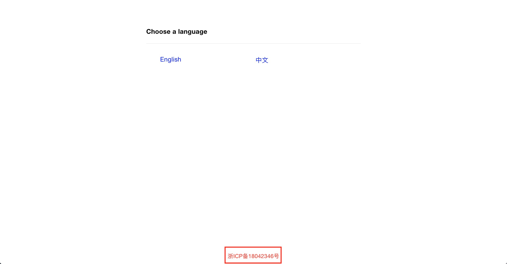
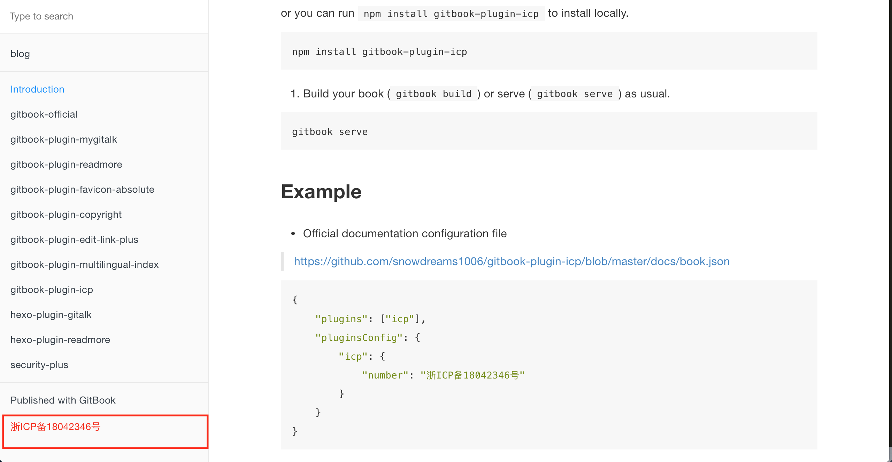

# Welcome to gitbook-plugin-icp 👋

[](https://www.npmjs.com/package/gitbook-plugin-icp)
[](https://www.npmjs.com/package/gitbook-plugin-icp)
[](https://www.npmjs.com/package/gitbook-plugin-icp)
[](https://github.com/snowdreams1006/gitbook-plugin-icp#readme)
[](https://github.com/snowdreams1006/gitbook-plugin-icp/graphs/commit-activity)
[](https://github.com/snowdreams1006/gitbook-plugin-icp/blob/master/LICENSE)
[](https://github.com/snowdreams1006)
[](https://snowdreams1006.tech/)
[](https://snowdreams1006.github.io/snowdreams1006-wechat-public.jpeg)

> gitbook plugin for adding icp info to footer

### 🏠 [Homepage](https://github.com/snowdreams1006/gitbook-plugin-icp#readme)

- Github : [https://snowdreams1006.github.io/gitbook-plugin-icp/](https://snowdreams1006.github.io/gitbook-plugin-icp/)
- GitLab: [https://snowdreams1006.gitlab.io/gitbook-plugin-icp/](https://snowdreams1006.gitlab.io/gitbook-plugin-icp/)
- Gitee : [https://snowdreams1006.gitee.io/gitbook-plugin-icp/](https://snowdreams1006.gitee.io/gitbook-plugin-icp/)

## Screenshot

- multilingual



- monolingual



## Usage

### Step #1 - Update `book.json` file

1. In you gitbook's `book.json` file, add `icp` to `plugins` list.
2. In `pluginsConfig`,Set the `number` value to your own icp.
3. In `pluginsConfig`,`label` or `link` value is NOT required.By default link url will be [http://www.beian.miit.gov.cn/](http://www.beian.miit.gov.cn/).

Here is simplest example :

```json
{
    "plugins": ["icp"],
    "pluginsConfig": {
        "icp": {
            "number": "浙ICP备18042346号"
        }
    }
}
```

In addition, the supported configuration options are as follows : 

```json
"gitbook": {
  "properties": {
    "label": {
      "type": "string",
      "title": "icp label",
      "required": false
    },
    "number": {
      "type": "string",
      "title": "icp number",
      "required": true
    },
    "link": {
      "type": "string",
      "title": "link url",
      "required": false,
      "default": "http://www.beian.miit.gov.cn/"
    },
    "style": {
      "type": "object",
      "title": "icp number style",
      "required": false
    }
  }
}
```

### Step #2 - gitbook commands

1. Run `gitbook install`. It will automatically install `icp` gitbook plugin for your book. This is needed only once.

```bash
gitbook install
```

or you can run `npm install gitbook-plugin-icp` to install locally.

```bash
npm install gitbook-plugin-icp
```

2. Build your book (`gitbook build`) or serve (`gitbook serve`) as usual.

```bash
gitbook serve
```

## Example

- Official documentation configuration file

> [https://github.com/snowdreams1006/gitbook-plugin-icp/blob/master/docs/book.json](https://github.com/snowdreams1006/gitbook-plugin-icp/blob/master/docs/book.json)

```json
{
    "plugins": ["icp"],
    "pluginsConfig": {
        "icp": {
            "number": "浙ICP备18042346号"
        }
    }
}
```

- Official example configuration file

> [https://github.com/snowdreams1006/gitbook-plugin-icp/blob/master/example/book.json](https://github.com/snowdreams1006/gitbook-plugin-icp/blob/master/example/book.json)

```json
{
    "plugins": ["icp"],
    "pluginsConfig": {
        "icp": {
            "number": "浙ICP备18042346号"
        }
    }
}
```

- Sample `book.json` file 

```json
{
    "plugins": ["icp"],
    "pluginsConfig": {
        "icp": {
            "number": "YOUR OWN ICP NUMBER"
        }
    }
}
```

or you can add `label` to custom your label:

```json
{
    "plugins": ["icp"],
    "pluginsConfig": {
        "icp": {
            "label": "YOUR OWN ICP LABEL",
            "number": "YOUR OWN ICP NUMBER"
        }
    }
}
```

or you can add `link` to custom your link:

```json
{
    "plugins": ["icp"],
    "pluginsConfig": {
        "icp": {
            "label": "YOUR OWN ICP LABEL",
            "number": "YOUR OWN ICP NUMBER",
            "link":"YOUR OWN ICP LINK"
        }
    }
}
```

or you can add `style` to custom your style of number:

```json
{
    "plugins": ["icp"],
    "pluginsConfig": {
        "icp": {
            "label": "YOUR OWN ICP LABEL",
            "number": "YOUR OWN ICP NUMBER",
            "link": "YOUR OWN ICP LINK",
            "style": {
              "color":  "#f72b07"
            }
        }
    }
}
```

**Note**: Above snippet can be used as complete `book.json` file, if your book doesn't have one yet.

## Author

👤 **snowdreams1006**

- Website: [snowdreams1006.tech](https://snowdreams1006.tech/)
- Github: [@snowdreams1006](https://github.com/snowdreams1006)
- Email: [snowdreams1006@163.com](mailto:snowdreams1006@163.com)

## Contributing

Contributions, issues and feature requests are welcome!<br />Feel free to check [issues page](https://github.com/snowdreams1006/gitbook-plugin-icp/issues).

## Show your support

Give a [**Star**](https://github.com/snowdreams1006/gitbook-plugin-icp) if this project helped you!

## Copyright

Copyright © 2019 [snowdreams1006](https://github.com/snowdreams1006).

This project is [MIT](https://github.com/snowdreams1006/gitbook-plugin-icp/blob/master/LICENSE) licensed.